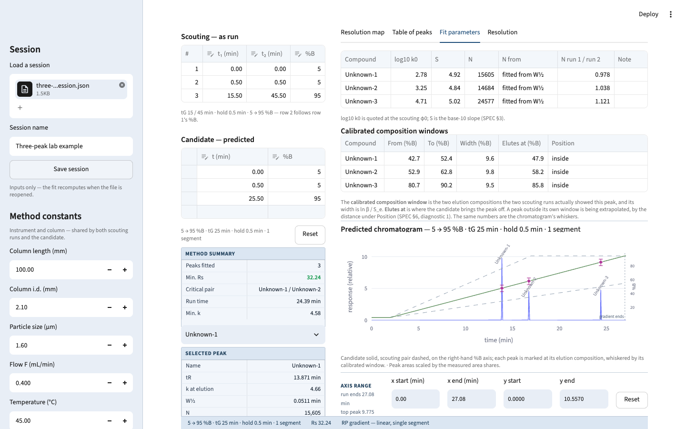
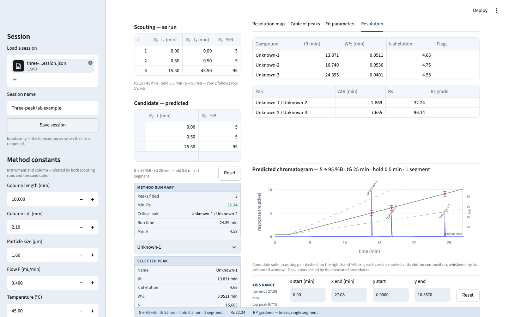

# HPLC Gradient Method Simulator

A Python HPLC simulator for working chromatographers, inspired by ACD/Labs Method Selection Suite: enter two gradient scouting runs, fit per-peak LSS retention parameters, and predict retention times, peak widths, resolution, and the chromatogram for any candidate gradient programme.

**Status: v0.2.0 — gradient freedom.** The candidate is no longer tied to the scouting runs' composition range: it carries its own start, its own end and any number of segments, entered as a programme table in the rail. Predictions outside what the two scouting runs calibrated are still made, and are marked for what they are — the composition-window readout says per peak how far outside it sits, and resolution that was never pinned there is stamped *indicative, not decision-grade*.

The approved specification is [SPEC.md](SPEC.md); the science was validated against real lab runs before build (see `validation/`). Planning ran as two wayfinder maps: [#1](https://github.com/zhipengzhu1-dotcom/24-Aug-2026-HPLC-Simulator-v0.1.0/issues/1) for v0.1 and [#41](https://github.com/zhipengzhu1-dotcom/24-Aug-2026-HPLC-Simulator-v0.1.0/issues/41) for v0.2.

## What it looks like

Both screenshots load the three-compound lab runs from `validation/` (scouting at tG 15 and
45 min) and predict a 25-minute candidate. The predicted retention times, 13.871, 16.740 and
24.395 min, compare with 13.787, 16.658 and 24.358 min measured on the instrument in
`validation/run3.csv`.





## Quickstart

You need [uv](https://docs.astral.sh/uv/) and Python ≥ 3.12 — uv fetches a matching interpreter itself if you have none. Every command below is run from the repo root; uv creates and syncs the environment on first use, so there is no separate install step.

### Run the app

```bash
uv run --extra app streamlit run streamlit_app.py
```

Then open <http://localhost:8501>.

`--extra app` is not optional: Streamlit, pandas and plotly are declared as an optional
extra, so a plain `uv run streamlit …` fails on a fresh checkout. On its very first launch
Streamlit asks for an email address — press Enter to skip it, or add `--server.headless true`
to suppress the prompt (that also stops it opening a browser tab for you).

### Run the tests

```bash
uv run pytest
```

This is the whole bar: the internal, reference and reality layers of SPEC §10, plus the
end-to-end fixtures built from the lab runs in `validation/`.

### Lint, format and type-check

```bash
uv run ruff check
uv run ruff format --check
uv run mypy
```

`mypy` runs strict over the engine (`src/hplcsim`) and the app's logic layer (`app/`); only
the root `streamlit_app.py` entry point is excluded.

## Driving it with real data

`validation/` holds four real runs of the same three-compound mixture on a Waters Acquity
H-Class with a CORTECS UPLC Shield RP18 column, which makes it the fastest way to see the
app do something true:

1. **Fill the sidebar** from `validation/method.csv` — 100 × 2.1 mm, 1.6 µm, 0.4 mL/min,
   5 → 95 %B, 0.5 min initial hold, dwell 0.9375 min, t0 0.525 min.
2. **Enter the peaks** from `validation/run1.csv` (tG 15 min) and `validation/run2.csv`
   (tG 45 min) — three compounds, each with a retention time, an area and a W½ per run.
   Those two are the scouting pair.
3. **Predict**: set a candidate tG of 25 min and compare against `validation/run3.csv`, which
   is the same method actually run on the instrument. tG 60 min extrapolates against `run4.csv`.

Two honest caveats about that dataset: the dwell volume is the instrument spec-sheet figure,
**not** a measured one, and t0 is the solvent front read off `validation/run1-chromatogram.png`
rather than an injected marker. Both are recorded with their provenance in
`validation/method.csv`, and `validation/PROTOCOL.md` describes how the runs were collected.

Sessions save and reload as a JSON file from within the app (SPEC §8). The file holds
**inputs only** — the fit recomputes on load, so a session file never carries a stale result.

## Where things are written down

| File | What it holds |
|---|---|
| [SPEC.md](SPEC.md) | The approved, normative specification |
| [CLAUDE.md](CLAUDE.md) | Repo standards: architecture rules, units, tooling, process |
| `docs/research/` | The science behind the model, with citations |
| `docs/handoffs/` | Session-by-session build record |
| [docs/running-the-app.md](docs/running-the-app.md) | How to start, open, and stop the app and the prototype branches |
| `validation/` | Real instrument data and the protocol that produced it |

## Licence

MIT — see [LICENSE](LICENSE). The science it implements is published theory, cited in `docs/research/`; no code was taken from projects under non-commercial or copyleft terms (the survey in `docs/research/github-hplc-simulators.md` records which those are).
